<div align="center">

# CodePower · 智能编程学习平台

**在线判题 · 竞赛组织 · 学习路径 · AI 辅助 · 能力画像**

[](https://openjdk.org/)
[](https://spring.io/projects/spring-boot)
[](https://vuejs.org/)
[](https://www.mysql.com/)
[](https://redis.io/)
[](#-版权声明与使用限制)

本科毕业设计 · 软件工程 · 2026

</div>

---

## 目录

- [项目简介](#-项目简介)
- [系统预览](#-系统预览)
- [功能模块](#-功能模块)
- [技术栈](#-技术栈)
- [系统架构](#-系统架构)
- [核心设计](#-核心设计)
- [目录结构](#-目录结构)
- [快速开始](#-快速开始)
- [Judge0 评测集群接入说明](#-judge0-评测集群接入说明)
- [数据库说明](#-数据库说明)
- [接口文档](#-接口文档)
- [版权声明与使用限制](#-版权声明与使用限制)

---

## 项目简介

CodePower 是一个面向程序设计学习者的**在线编程练习与竞赛平台**。系统以"做题 → 评测 → 反馈 → 推荐"的学习闭环为核心，在传统 OJ（Online Judge）能力之上，补充了**学习路径引导、能力画像分析、AI 辅助答疑与出题、积分成长体系**等教学向功能。

**项目规模**

| 指标 | 数值 |
| --- | --- |
| 后端 Java 源文件 | 187 个（约 2.15 万行） |
| 前端 Vue/TS 源文件 | 55 个（约 3.0 万行） |
| 数据库表 | 49 张 |
| Flyway 迁移脚本 | 46 个 |
| REST 控制器 | 24 个 |
| 业务服务 | 58 个（31 个接口 + 27 个实现） |
| 实体类 / Mapper | 47 / 40 个 |

**技术亮点**

- 基于 **Judge0** 构建的远程多节点评测集群，含判题队列、并发控制、限流与节点健康观测
- **AI 模型网关**：多 Provider、多模型运行时热切换，支持从 Provider 拉取模型列表并动态导入
- **能力画像与个性化推荐**：基于做题记录建模用户能力分布，驱动题目推荐与学习路径
- **登录编程题验证**：以算法题替代图形验证码，兼顾安全与学习引导
- **多级缓存策略**：Caffeine 本地缓存 + Redis 分布式缓存，覆盖题目列表、提交运行时、会话等热点路径
- 数据库层使用 **Flyway** 版本化管理，含视图、存储过程、触发器与完整性约束

---

## 系统预览

### 系统首页

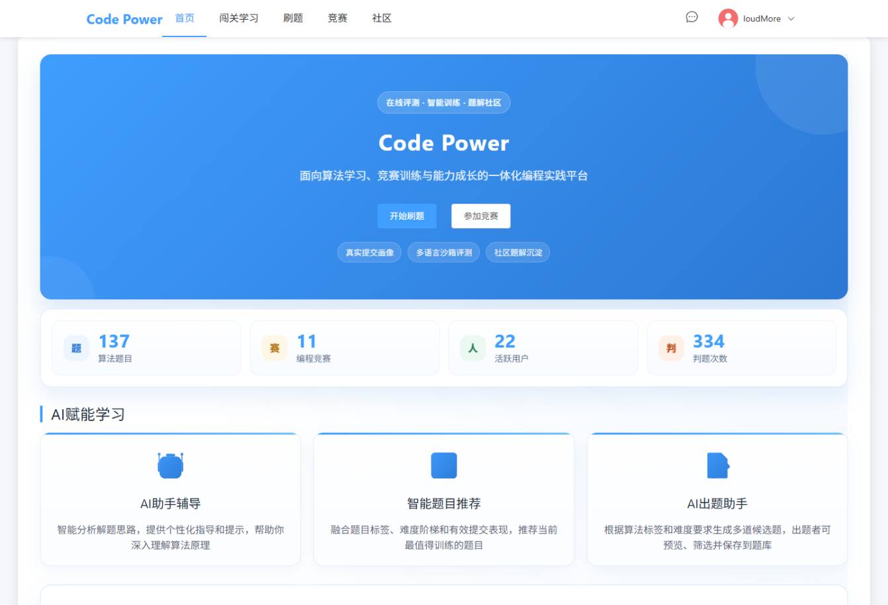

### 题库列表

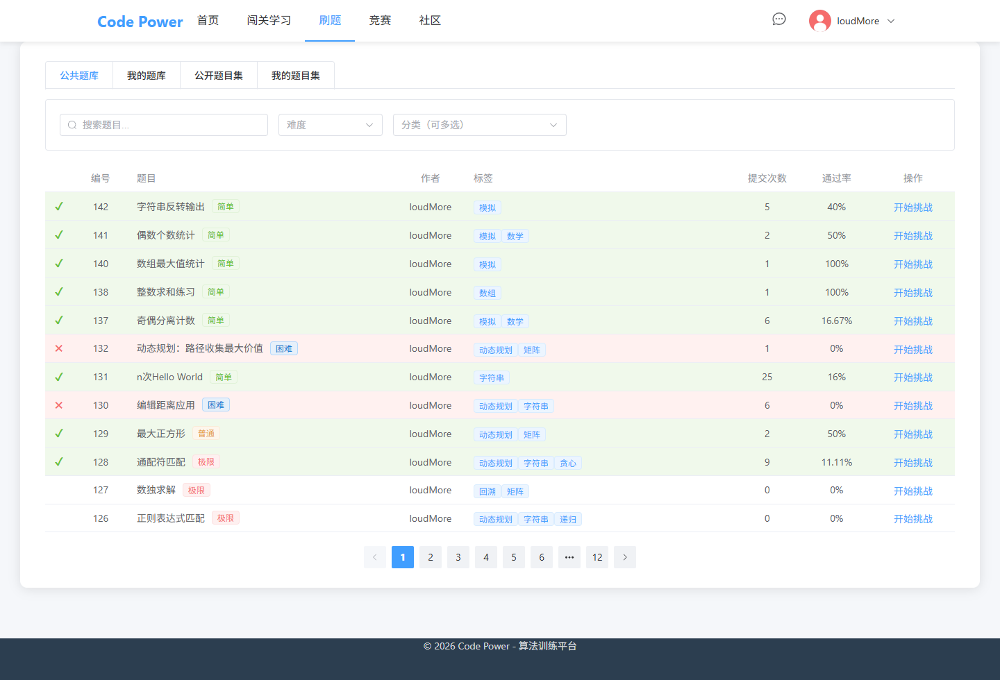

### 做题 IDE 与在线评测入口

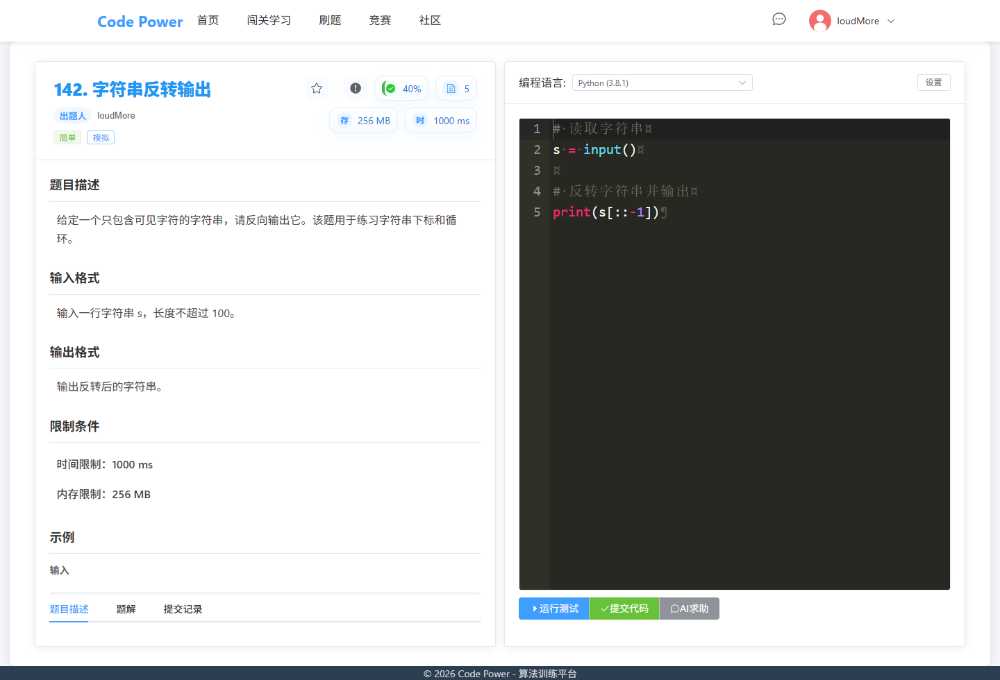

### 竞赛列表

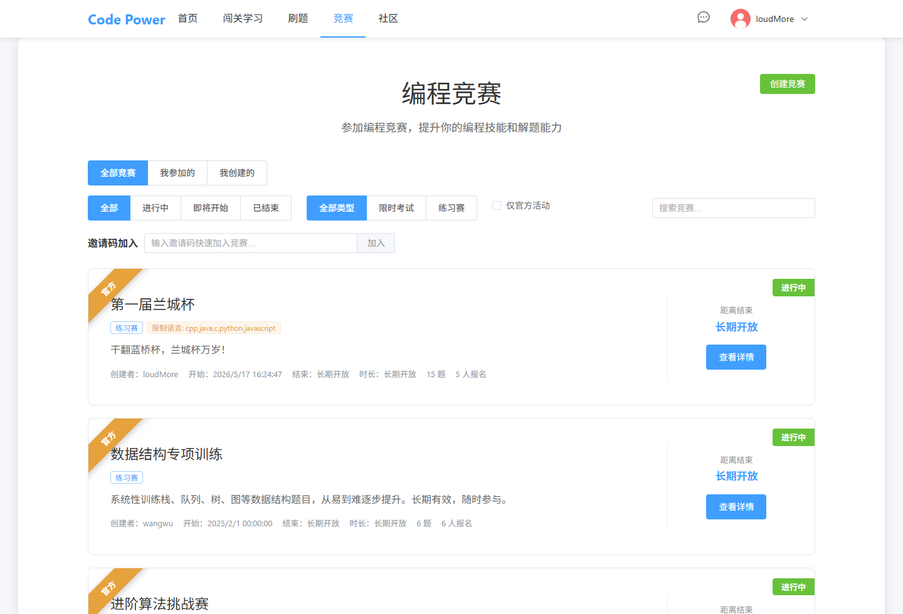

### 学习路径

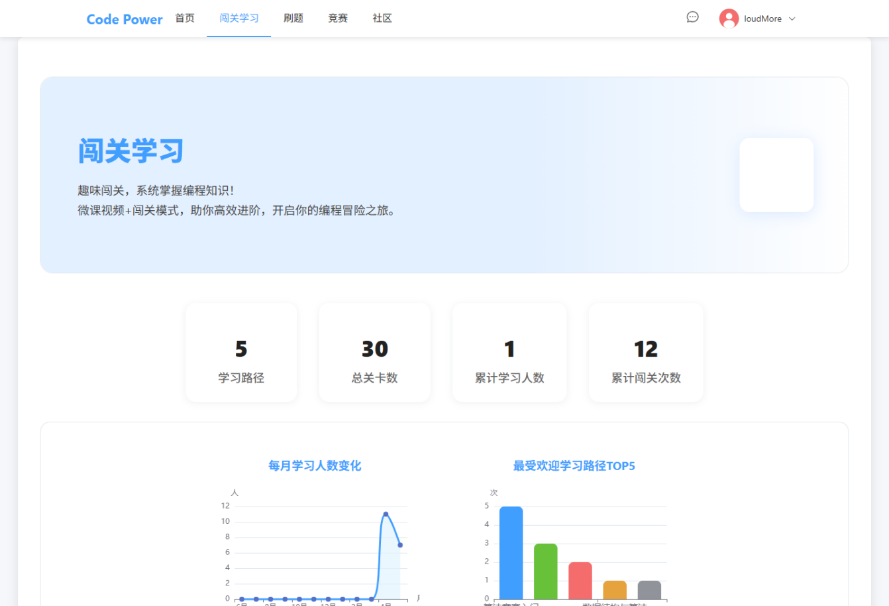

### 题解社区

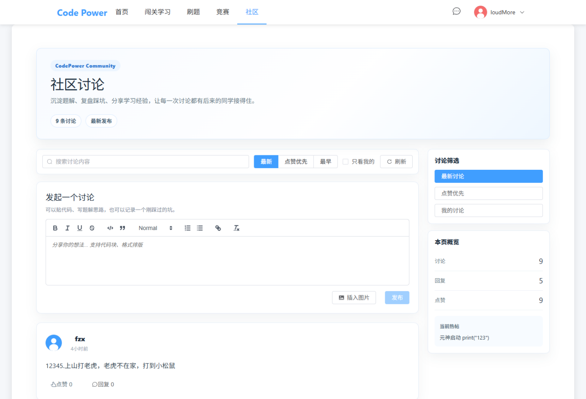

### 管理后台 · AI 模型配置

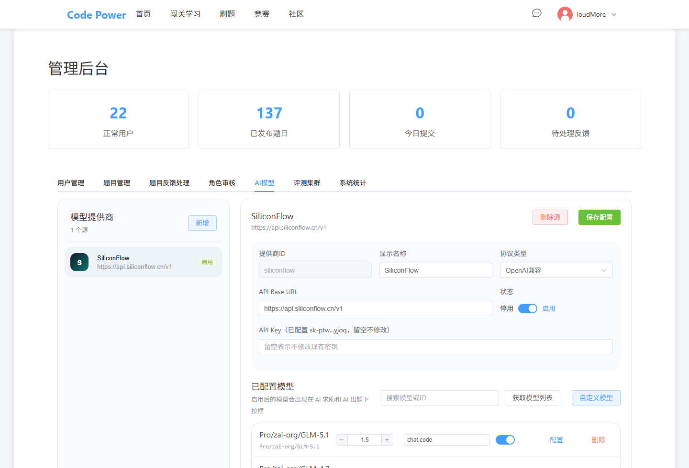

### 管理后台 · 评测集群状态

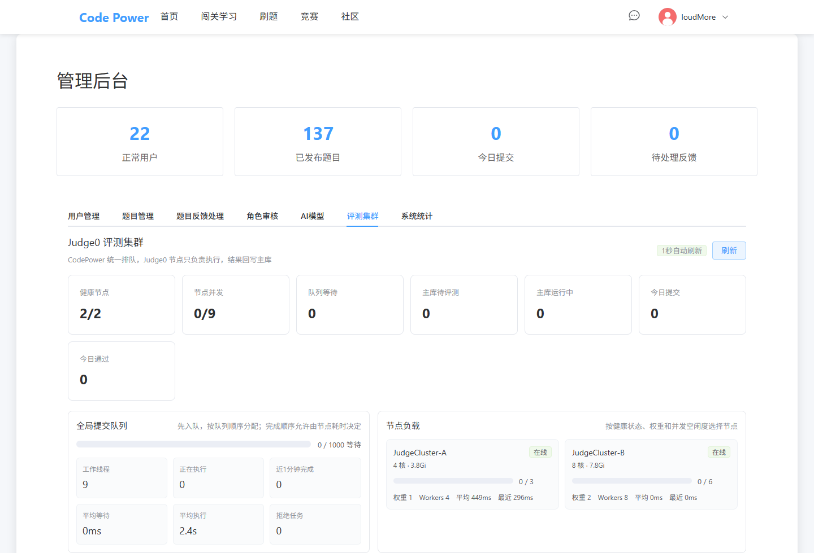

> 全部界面截图见 [`docs/images/screenshots/`](docs/images/screenshots/)，系统设计图表见 [`docs/images/design/`](docs/images/design/)。

---

## 功能模块

### 一、认证与权限

| 功能 | 说明 |
| --- | --- |
| 账号体系 | 注册、登录、邮箱验证、找回密码 |
| 图形验证码替代方案 | **登录编程题验证**——用户需答对一道算法题方可登录，兼具安全性与学习引导 |
| 第三方登录 | 支持 GitHub / Gitee / QQ / 微信 OAuth 绑定与解绑，含绑定操作审计日志 |
| 鉴权 | Spring Security + JWT 无状态鉴权，按角色分层授权 |
| 用户角色 | 普通用户 / 高级用户 / 管理员三级，含角色升级申请与审批流 |

### 二、题库与判题

| 功能 | 说明 |
| --- | --- |
| 题目管理 | 题面、难度分级、可见性控制、标签体系、公开样例与隐藏测试用例 |
| 题目集 | 支持按专题组织题目集，含题目集维护与排序 |
| 在线评测 | 对接 Judge0 执行多语言代码，返回编译信息、用例通过情况、耗时与内存 |
| 判题集群 | 多节点配置、并发上限控制、判题队列、限流保护、节点状态观测 |
| 高级用户出题 | 高级用户可自主创建题目与竞赛，形成内容生产闭环 |
| 题目反馈 | 用户可对题目报错，进入处理流程并通知出题人 |

### 三、竞赛

| 功能 | 说明 |
| --- | --- |
| 竞赛组织 | 创建竞赛、配置赛制与时间窗、绑定题目、设置访问密码 |
| 参赛 | 报名、邀请、赛中提交、实时排名 |
| 状态管理 | 竞赛状态字典化管理（未开始 / 进行中 / 已结束等） |
| 边界处理 | 竞赛时间边界归一化，避免跨时区与临界时刻的状态歧义 |

### 四、学习成长

| 功能 | 说明 |
| --- | --- |
| 学习路径 | 分阶段学习路线，阶段与题目关联，记录完成进度 |
| 能力画像 | 基于做题记录构建能力分布模型，可视化展示强项与短板 |
| 个性化推荐 | 画像驱动的题目推荐，含推荐评分模型与推荐示例 |
| 每日任务 | 每日任务体系，含防刷状态转移控制 |
| 积分与等级 | 30 级成长体系、积分双池设计、等级权益与 AI 额度挂钩 |
| 签到 | 连续签到与奖励发放 |

### 五、AI 能力

| 功能 | 说明 |
| --- | --- |
| AI 模型网关 | 多 Provider、多模型统一接入，OpenAI 兼容协议 |
| 模型动态导入 | 从 Provider 拉取可用模型列表并批量导入启用 |
| AI 教师模式 | 题目思路引导、代码问题诊断、学习建议 |
| 会话管理 | AI 对话会话与消息持久化，按用户额度扣减 |
| 额度控制 | AI 调用额度与等级/积分联动 |

### 六、社区与消息

| 功能 | 说明 |
| --- | --- |
| 题解社区 | 题解发布、点赞、评论、题解质量激励与来源校验 |
| 私信 | 用户间实时私信（WebSocket），含防骚扰控制 |
| 关注 | 用户关注关系 |
| 通知 | 多类型站内通知，按类型字典化 |
| 系统公告 | 公告发布与已读记录 |

### 七、管理后台

| 功能 | 说明 |
| --- | --- |
| 用户治理 | 用户列表、检索、状态管理、角色升级审批 |
| 内容治理 | 题目与题解审核、举报处理、评论管理 |
| AI 配置 | Provider 与模型配置、启用/停用、倍率与上下文长度设置 |
| 评测运维 | 判题集群节点状态、并发与限流观测 |
| 数据分析 | 平台运营数据统计与可视化 |

---

## 技术栈

### 后端

| 类别 | 技术 |
| --- | --- |
| 语言 / 运行时 | Java 21 |
| 框架 | Spring Boot 3.2.4、Spring MVC、Spring Security、Spring WebSocket |
| 持久层 | MyBatis-Plus、MySQL 8.0 |
| 数据库版本管理 | Flyway（46 个迁移脚本） |
| 缓存 | Redis（Spring Data Redis）、Caffeine（本地缓存） |
| 鉴权 | JJWT |
| 接口文档 | SpringDoc OpenAPI (Swagger UI) |
| 邮件 | Spring Boot Mail |
| 文档处理 | Apache POI（题目批量导入） |
| 模板引擎 | Thymeleaf（邮件与静态页） |
| 其他 | Lombok、Commons IO、Jackson |

### 前端

| 类别 | 技术 |
| --- | --- |
| 框架 | Vue 3.4（Composition API） |
| 构建 | Vite 5 |
| 语言 | TypeScript 5 |
| 状态管理 | Pinia |
| 路由 | Vue Router 4 |
| UI 组件 | Element Plus |
| 代码编辑器 | Ace Editor（vue3-ace-editor / ace-builds） |
| 富文本 | VueQuill |
| 图表 | ECharts 5 |
| Markdown | marked |
| 请求 | Axios |
| 代码规范 | ESLint |

### 外部依赖

| 组件 | 用途 |
| --- | --- |
| **Judge0** | 代码沙箱执行与评测（远程多节点部署） |
| OpenAI 兼容 LLM API | AI 教师、题目诊断等能力 |
| SMTP 服务 | 邮箱验证与通知 |

---

## 系统架构

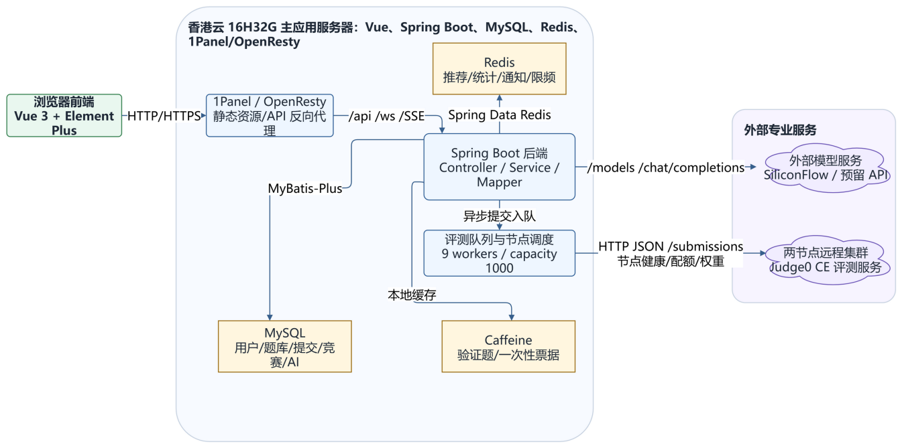

### 部署拓扑

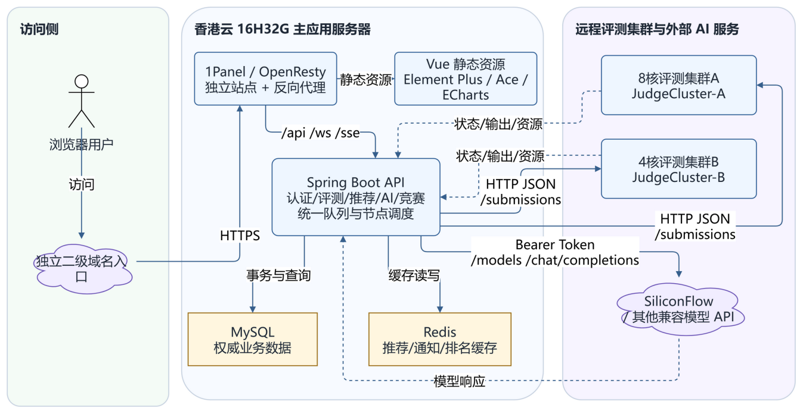

### 核心学习闭环

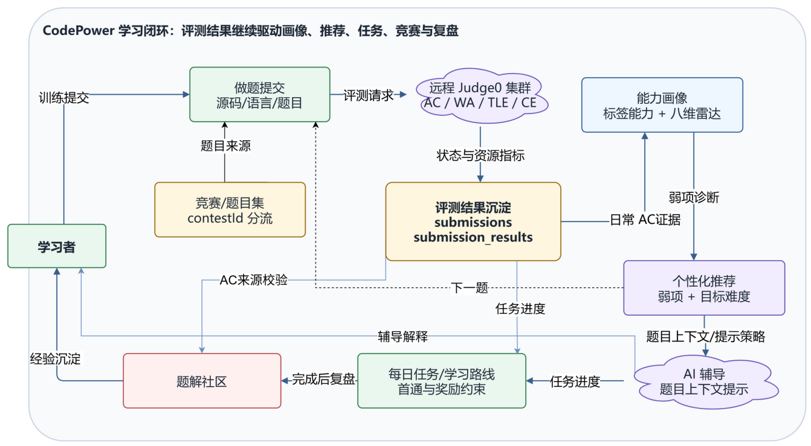

### 模块联动关系

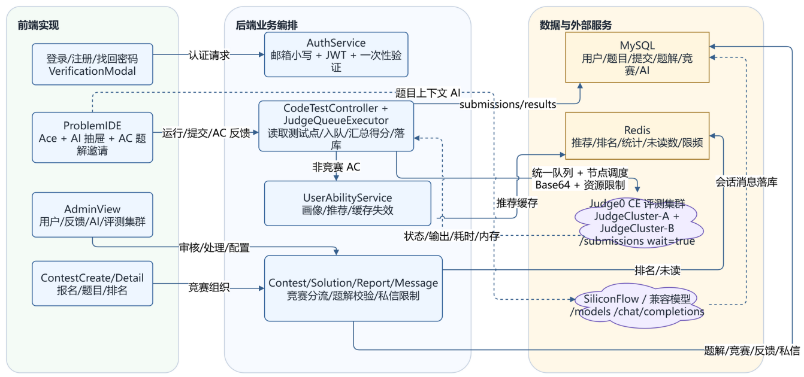

### 访问与资源控制分层

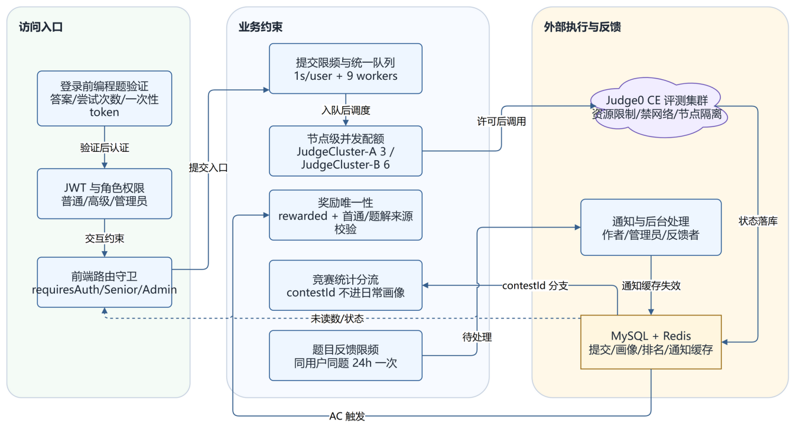

### 缓存读写与失效关系

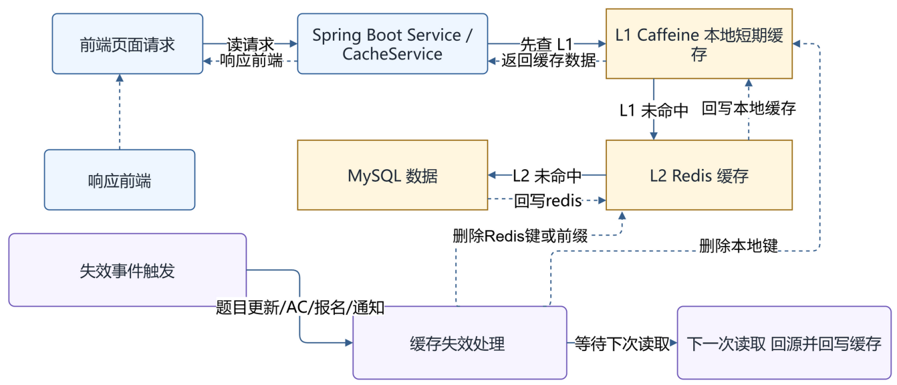

### 数据模型

| 核心 ER 图 | 竞赛 ER 图 | AI 网关 ER 图 |
| --- | --- | --- |
| 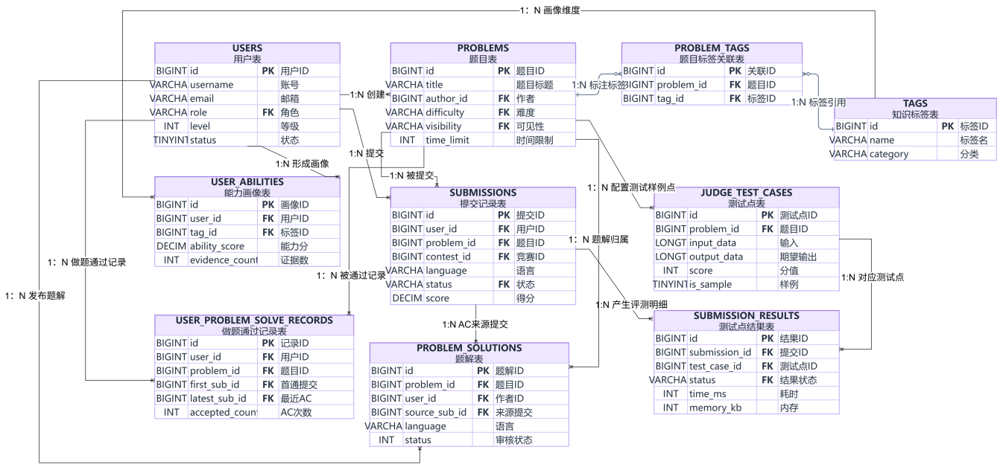 | 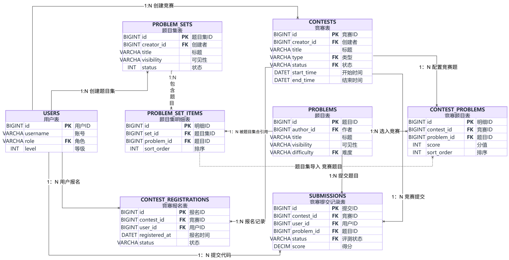 | 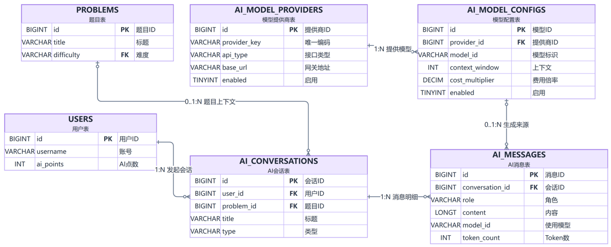 |

> 完整设计文档（数据流图、时序图、流程图、状态机图）见 [`docs/images/design/`](docs/images/design/)。

---

## 核心设计

### 1. 判题集群：队列、并发与限流

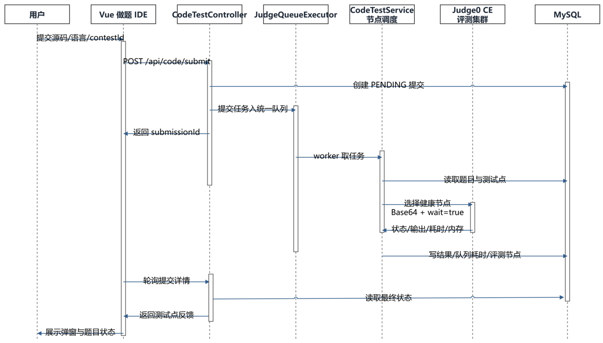

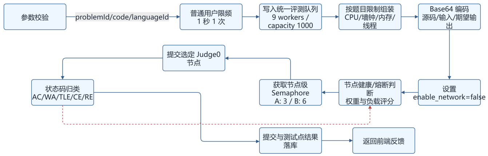

判题是本系统资源消耗最大、最需要保护的链路。设计中做了三层控制：

- **队列层** — `JudgeQueueExecutor` 统一收口提交请求，按并发上限排队执行，避免瞬时高并发压垮评测节点
- **限流层** — `JudgeRateLimitService` 对用户与全局维度分别限流，防止单一用户占满评测资源
- **资源层** — 通过 `Judge0Properties` 下发单次评测的时间限制、额外 CPU 时间、内存上限、进程与线程数限制，并对 JVM 类语言单独放宽进程数（JVM 自身需要较多线程）

相关实现：

```
src/main/java/com/ls/config/Judge0Properties.java      多节点与资源限制配置绑定
src/main/java/com/ls/service/JudgeQueueExecutor.java   判题队列与并发控制
src/main/java/com/ls/service/JudgeRateLimitService.java 判题限流
src/main/java/com/ls/service/impl/CodeTestServiceImpl.java 提交与结果轮询
src/main/java/com/ls/controller/AdminController.java   集群状态观测
```

### 2. 登录编程题验证

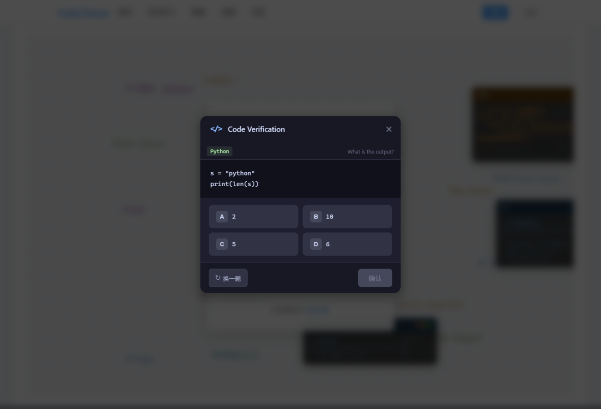

以一道算法题替代传统图形验证码：用户登录时需提交可运行的代码并通过评测。相比图形验证码，它对人机区分更稳健（需要真实编程能力），同时让每次登录都成为一次练习。

时序见 [登录与编程题验证时序图](docs/images/design/12-seq-login-captcha.png)。

### 3. AI 模型网关

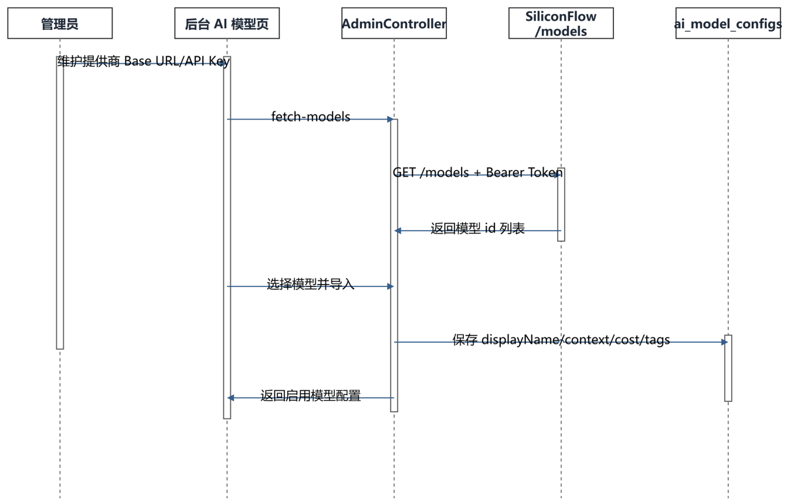

- **多 Provider 抽象**：Provider 维度配置协议类型、Base URL、密钥与倍率，业务层不感知具体厂商
- **模型热切换**：模型配置存库，可在管理后台运行时启用/停用与调整倍率，无需重启
- **模型动态导入**：从 Provider 拉取可用模型列表批量导入，避免手工维护
- **额度联动**：AI 调用额度与用户等级、积分体系挂钩，按倍率扣减

### 4. 能力画像与个性化推荐

| 能力画像数学模型 | 推荐算法流程 | 推荐评分模型 |
| --- | --- | --- |
| 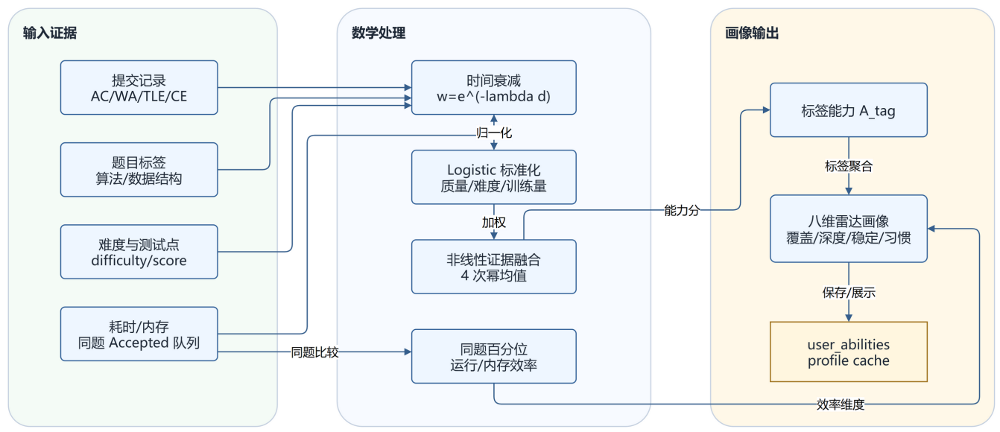 | 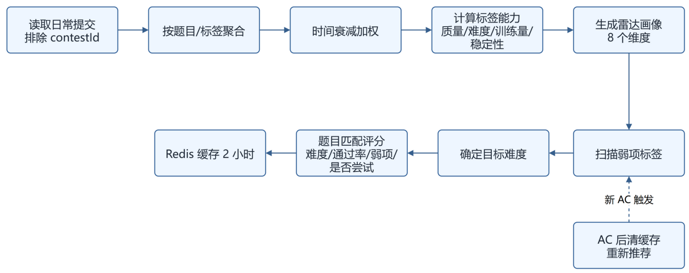 | 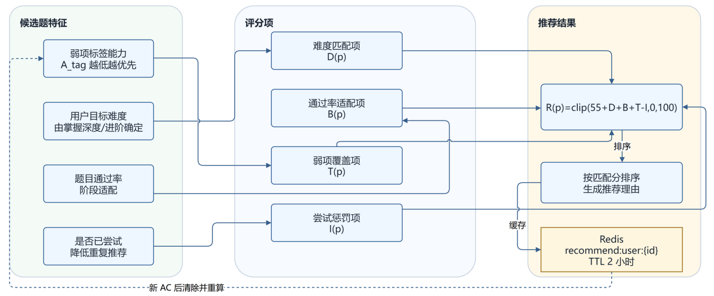 |

基于用户历史提交记录，按标签维度统计解题表现，构建能力分布模型；推荐环节结合能力短板、题目难度与用户当前学习阶段计算推荐分数。

### 5. 成长体系与防刷

| 每日任务防刷状态转移 | AC 后题解激励与来源校验 |
| --- | --- |
| 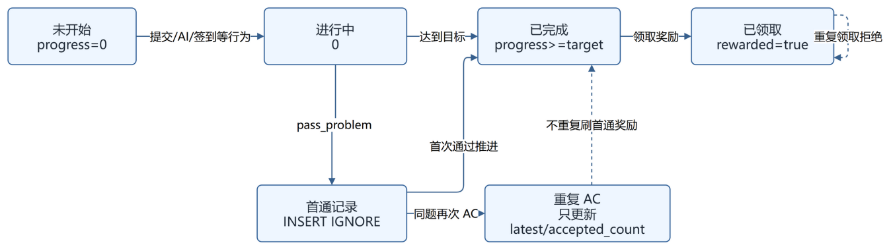 | 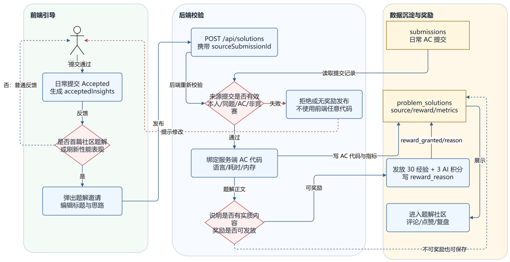 |

积分采用**双池设计**区分可消费积分与经验值，避免积分被单一行为刷取；每日任务通过状态转移约束领取条件。

---

## 目录结构

```
CodePower/
├── codepower-backend/                    # 后端服务（Spring Boot）
│   ├── pom.xml
│   └── src/
│       ├── main/
│       │   ├── java/com/ls/
│       │   │   ├── common/               # 通用返回体、异常、常量
│       │   │   ├── config/               # 配置类（含 Judge0Properties 等）
│       │   │   ├── controller/           # 25 个 REST 控制器
│       │   │   ├── domain/               # 实体、DTO、VO
│       │   │   ├── event/                # 领域事件
│       │   │   ├── mapper/               # MyBatis-Plus 数据访问
│       │   │   ├── scheduler/            # 定时任务
│       │   │   ├── service/              # 业务服务与实现
│       │   │   ├── utils/                # 工具类
│       │   │   └── websocket/            # 私信等 WebSocket 端点
│       │   └── resources/
│       │       ├── application.properties        # 主配置（全部走环境变量占位）
│       │       ├── application.example.properties# 配置样例
│       │       └── db/                            # Flyway 迁移脚本
│       └── test/
├── codepower-frontend/                   # 前端应用（Vue 3 + Vite）
│   ├── package.json
│   ├── vite.config.ts
│   └── src/
│       ├── api/                          # 接口封装
│       ├── components/                   # 公共组件
│       ├── router/                       # 路由
│       ├── stores/                       # Pinia 状态
│       └── views/                        # 页面
│           ├── admin/                    #   管理后台
│           ├── auth/                     #   登录注册
│           ├── community/                #   题解社区
│           ├── contests/                 #   竞赛
│           ├── home/                     #   首页
│           ├── learning/                 #   学习路径
│           ├── message/                  #   私信
│           ├── notification/             #   通知
│           ├── problems/                 #   题库与做题
│           ├── profile/                  #   个人中心
│           └── training/                 #   训练与题目集
├── database/
│   └── codepower_demo.sql                # 数据库结构 + 演示数据（已脱敏）
└── docs/
    └── images/
        ├── design/                       # 系统设计图表（架构/ER/DFD/时序/流程）
        └── screenshots/                  # 系统运行界面截图
```

---

## 快速开始

### 环境要求

| 组件 | 版本 |
| --- | --- |
| JDK | 21+ |
| Maven | 3.8+ |
| Node.js | 18+ |
| MySQL | 8.0+ |
| Redis | 6+ |
| Judge0 | 1.13+（可远程部署，见下节） |

### 1. 初始化数据库

```bash
mysql -u root -p -e "CREATE DATABASE codepower DEFAULT CHARACTER SET utf8mb4 COLLATE utf8mb4_unicode_ci;"
mysql -u root -p codepower < database/codepower_demo.sql
```

> 说明：仓库内 SQL 已脱敏，用户密码哈希已替换为无效占位值，**无法直接登录**。首次启动时请通过注册接口创建你自己的账号。

### 2. 配置后端

复制配置样例并按本机环境填写：

```bash
cd codepower-backend
cp src/main/resources/application.example.properties src/main/resources/application-local.properties
```

关键配置项（均通过环境变量或配置文件注入，仓库内不含任何真实密钥）：

```properties
# 数据库
spring.datasource.url=jdbc:mysql://127.0.0.1:3306/codepower?useUnicode=true&characterEncoding=utf-8&serverTimezone=Asia/Shanghai
spring.datasource.username=root
spring.datasource.password=

# Redis
spring.data.redis.host=127.0.0.1
spring.data.redis.port=6379
spring.data.redis.password=

# JWT（生产环境务必替换）
jwt.secret=change-this-secret-in-production

# Judge0 评测节点
judge0.api.url=http://127.0.0.1:2358
judge0.nodes[0].auth-token=

# AI 模型（OpenAI 兼容协议）
ai.api.url=https://api.siliconflow.cn/v1
ai.api.key=
ai.api.model=deepseek-ai/DeepSeek-V3
```

### 3. 启动后端

```bash
cd codepower-backend
./mvnw spring-boot:run          # Windows: mvnw.cmd spring-boot:run
```

服务默认端口 `8080`。Flyway 会自动执行 `db/migration` 下的迁移脚本。

### 4. 启动前端

```bash
cd codepower-frontend
npm install
npm run dev
```

前端默认端口 `5173`，通过 `vite.config.ts` 中的代理转发到后端。

---

## Judge0 评测集群接入说明

> **本仓库不包含 Judge0 源码。** Judge0 是独立的开源代码执行系统，本项目通过 HTTP API 调用**你自己部署的 Judge0 实例**。运行时资源限制、并发与队列控制由本项目的后端负责，代码的实际隔离执行由 Judge0 及其底层容器机制负责。

### 为什么使用 Judge0

自行实现多语言代码沙箱需要处理容器隔离、资源限制、系统调用过滤、语言运行时镜像维护等大量底层工作。Judge0 已提供成熟的多语言隔离执行能力，本项目将精力集中在**评测业务流程**上：提交收口、队列排队、并发控制、限流保护、结果轮询、状态回写与学习反馈。

### 部署 Judge0

请参考官方仓库自行部署（推荐使用其官方 `docker-compose.yml`）：

- Judge0 官方仓库：<https://github.com/judge0/judge0>
- 官方文档：<https://github.com/judge0/judge0/blob/master/README.md>

典型部署形态（按官方文档执行）：

```bash
git clone https://github.com/judge0/judge0.git
cd judge0
# 按官方 README 配置 judge0.conf（数据库、Redis、worker 数量、资源限制等）
docker compose up -d
```

部署完成后，Judge0 默认在 `2358` 端口提供 API。若开启了鉴权，需在请求头携带 `X-Auth-Token`。

### 本项目如何接入

在 `application-local.properties` 中配置节点地址与令牌（支持多节点）：

```properties
# 单节点
judge0.api.url=http://<judge0-host>:2358
judge0.nodes[0].url=http://<judge0-host>:2358
judge0.nodes[0].auth-token=<your-judge0-token>

# 可选：第二节点，用于水平扩展
judge0.nodes[1].url=http://<judge0-host-2>:2358
judge0.nodes[1].auth-token=<your-judge0-token-2>
```

单次评测的资源限制同样在此配置：

```properties
judge0.api.wall-time-limit-seconds=3.0        # 单次评测总时限
judge0.api.cpu-extra-time-seconds=0.5         # CPU 时间额外宽限
judge0.api.max-memory-kb=512000               # 内存上限（KB）
judge0.api.max-processes-and-threads=2        # 进程/线程数上限（防 fork 炸弹）
judge0.api.jvm-max-processes-and-threads=32   # JVM 类语言单独放宽
judge0.api.max-concurrent-submissions=3       # 本机并发提交上限
```

> **提示**：`max-processes-and-threads` 是防止恶意代码（如 fork 炸弹）耗尽宿主机的关键参数；JVM 类语言因自身需要较多线程，需单独放宽，否则会误判为超限。

### 接入链路

```
用户提交代码
    │
    ▼
SubmissionController ──► JudgeRateLimitService   （用户级 / 全局限流）
    │
    ▼
JudgeQueueExecutor                                （队列排队 + 并发上限）
    │
    ▼
CodeTestServiceImpl ──► Judge0 API               （创建提交 → 轮询结果）
    │                        │
    │                        └─► Judge0 Worker ──► 隔离容器执行 ──► 返回结果
    ▼
结果回写（submissions / submission_results / judge_test_cases）
    │
    ▼
学习反馈：能力画像更新、推荐刷新、积分与任务进度、通知
```

---

## 数据库说明

### 文件

| 文件 | 说明 |
| --- | --- |
| `database/codepower_demo.sql` | 库结构与演示数据导出（49 张表） |
| `codepower-backend/src/main/resources/db/migration/` | Flyway 增量迁移脚本（46 个） |

### 设计要点

- **字典表驱动状态**：竞赛状态、题目难度、提交状态、通知类型等均以字典表管理，避免硬编码枚举值散落
- **完整性约束**：使用外键、唯一约束、检查约束与触发器保障数据一致性，并实现软删除
- **视图与存储过程**：统计数据通过视图与存储过程/函数封装，减少应用层聚合逻辑
- **索引优化**：针对列表查询与热点路径单独编写索引迁移脚本（`list_cache_query_indexes`、`hot_path_indexes`）
- **题目数据**：迁移脚本按算法专题分批灌入题目（数学与数组、字符串与栈与哈希、排序与树与图、动态规划与贪心与回溯等）

> ⚠️ **数据脱敏说明**：仓库内的 SQL 已做脱敏处理——所有真实邮箱已替换为示例域名，密码哈希已替换为无效占位值，第三方 API 密钥已移除。**该文件仅用于展示表结构设计与演示数据分布，不含任何可用凭证。**

---

## 接口文档

项目集成 SpringDoc OpenAPI，启动后端后访问：

```
http://localhost:8080/swagger-ui/index.html
```

按业务域划分的控制器（共 24 个）：

| 业务域 | 控制器 |
| --- | --- |
| 认证授权 | `AuthController`、`OAuthController`、`VerificationController`、`UserController` |
| 题库判题 | `ProblemController`、`ProblemSetController`、`SubmissionController`、`CodeTestController`、`TagController`、`FavoriteProblemController` |
| 竞赛 | `ContestController` |
| 学习成长 | `LearningPathController`、`DailyTaskController`、`CheckInController`、`UserLevelController`、`DataAnalysisController` |
| AI | `AiController` |
| 社区消息 | `CommentController`、`ProblemSolutionController`、`PrivateMessageController`、`NotificationController`、`SystemAnnouncementController`、`UserFollowController`、`ProblemReportController` |
| 管理 | `AdminController` |

---

## 版权声明与使用限制

**本项目为作者的本科毕业设计作品。作者保留本项目的全部著作权。**

- ✅ **允许**：个人学习、技术交流、教学参考、代码阅读与研究
- ❌ **禁止**：任何形式的商业用途，包括但不限于将本项目或其衍生作品用于商业产品销售、商业服务提供、商业项目交付
- ❌ **禁止**：在未注明出处的情况下将本项目整体或实质性部分作为他人成果提交（包括课程作业、毕业设计、论文、竞赛作品等）
- ❌ **禁止**：移除或修改本声明与作者署名信息

**引用或参考本项目时，请注明来源与作者。**

```
Copyright (c) 2026 何玉泽. All Rights Reserved.
本项目仅供学习交流使用，未经授权禁止商业用途。
```

> 如需用于商业场景或获取授权，请通过邮箱联系作者。

---

<div align="center">

**如果这个项目对你的学习有帮助，欢迎 Star ⭐**

</div>
